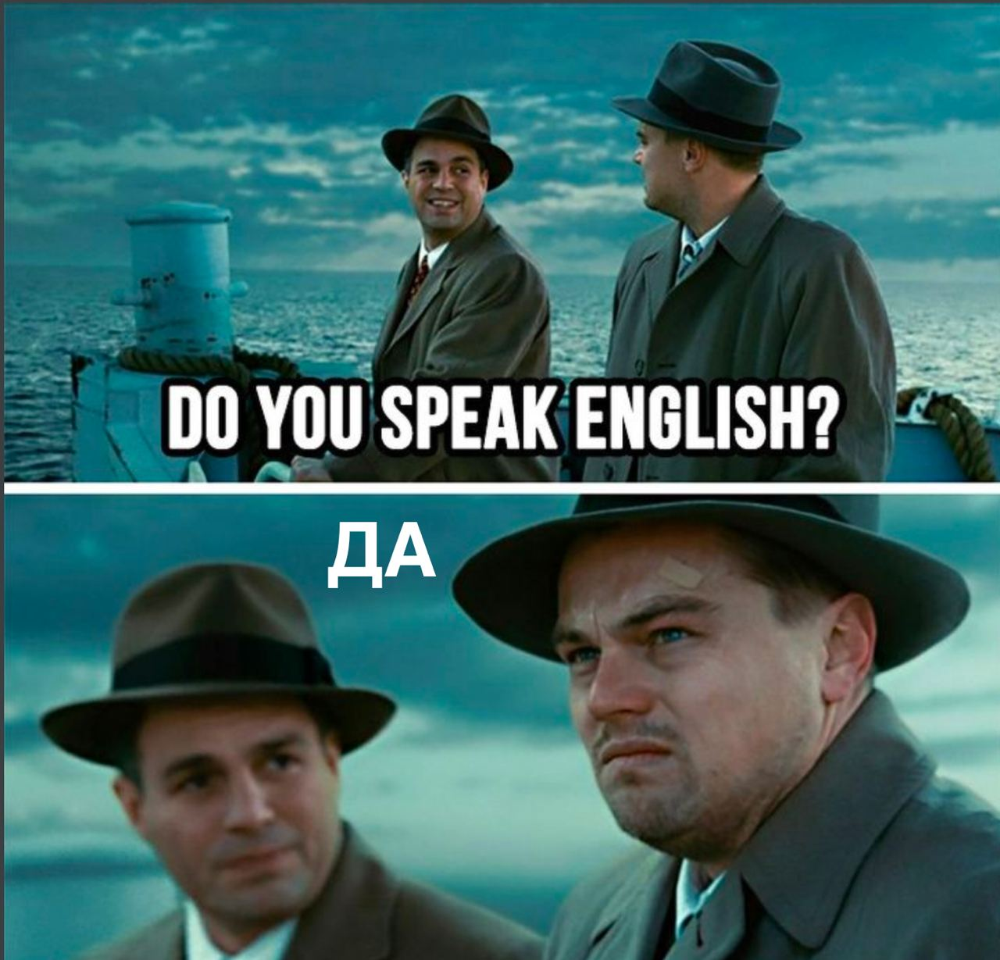

## Распознавание текста на изображении с помощью Tesseract

Tesseract OCR — это оптический механизм чтения символов на основе нейронных сетей, разработанный лабораториями HP в 1985 году и открытый в 2005 году. С 2006 года он разрабатывается Google.Плюсами данной библиотеки можно отметить обученные языковые модели (>192), разные виды распознавания (изображение как слово, блок текста, вертикальный текст), легкая настройка. Так как Tesseract OCR написан на языке C++, был использован сторонний wrapper c github.

-----------
#### Пример распознавания:

Изображение:


Распознанный текст:  
DO YOU SPEAK ENGLISH? ДА

-----------
Сделано на основе **[статьи](https://habr.com/ru/company/funcorp/blog/518340/)**
-----------
tesseract installation:
```
brew install tesseract
brew install tesseract-lang
```

```tesseract test2.jpg out -l eng+rus```