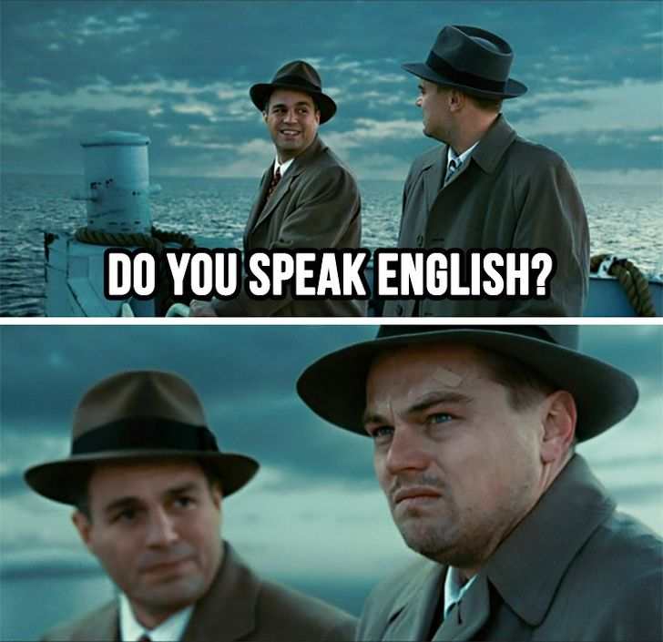

## Распознавание текста на изображении с помощью Tesseract

Tesseract OCR — это оптический механизм чтения символов, разработанный лабораториями HP в 1985 году и открытый в 2005 году. С 2006 года он разрабатывается Google.

-----------
#### Пример распознавания:

Изображение:

Распознанный текст: DO YOU SPEAK ENGLISH?

-----------
Сделано на основе **[статьи](https://habr.com/ru/company/funcorp/blog/518340/)**